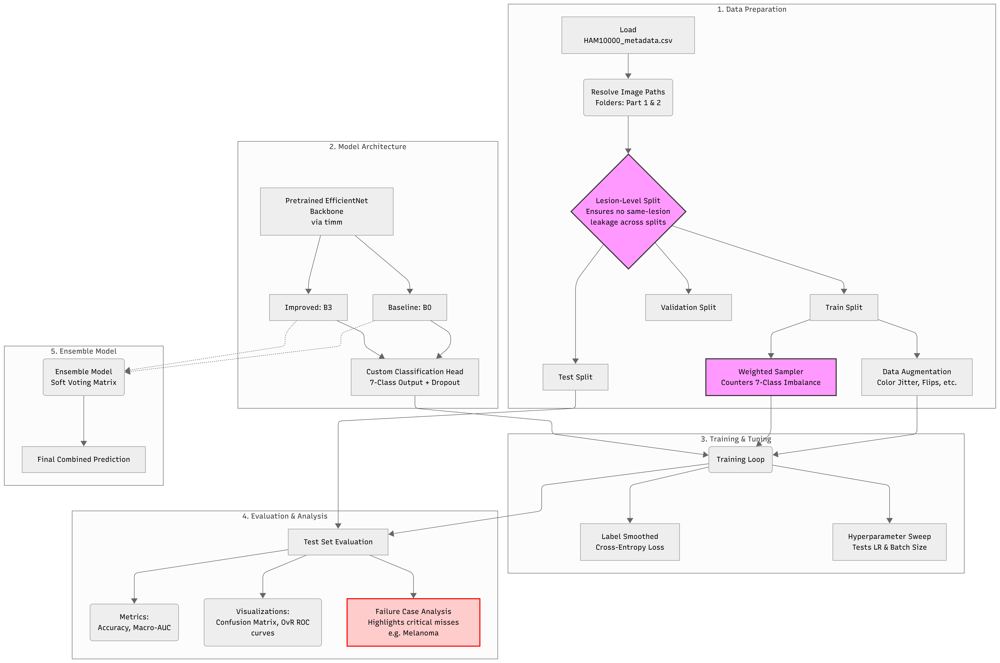
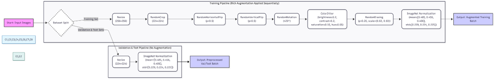

# Skin Lesion Classification via Transfer Learning

<div align="center">


</div>

> **Authors:** Ahmed Yar · Manahil Bashir  
> **Affiliation:** Department of Computer Science, National University of Sciences & Technology (NUST)

---

## Overview

This project presents a deep-learning system for automated **seven-class skin lesion classification** using the [HAM10000](https://www.kaggle.com/datasets/kmader/skin-cancer-mnist-ham10000) dermoscopy dataset. Skin cancer is among the most prevalent malignancies worldwide; automated, computer-aided diagnosis (CAD) systems can reduce inter-observer variability and extend diagnostic reach in regions with limited access to expert dermatologists.

**Core technical challenges addressed:**

- **Severe class imbalance** — melanocytic nevi (_nv_) constitute ~67% of all images
- **Data leakage prevention** — multiple images per lesion require lesion-level (not image-level) stratified splitting
- **Fine-grained visual similarity** — _bkl_, _mel_, and _nv_ share overlapping dermoscopic features
- **Clinical cost asymmetry** — false-negative melanoma diagnoses carry disproportionately high clinical risk

**Approach:** Two EfficientNet models (B0 baseline, B3 improved) are fine-tuned via transfer learning from ImageNet weights. Class imbalance is countered through weighted random sampling and label smoothing. A soft-voting ensemble of both models achieves a **macro One-vs-Rest AUC of 0.9659** on the held-out test set.

---

## System Architecture



The pipeline is organized into five interconnected stages:

1. **Data Preparation** — Loads `HAM10000_metadata.csv`, resolves image paths across two image directories, and performs **lesion-level stratified splitting** (75% train / 15% val / 10% test) to guarantee no same-lesion leakage across partitions. A `WeightedRandomSampler` is applied to the training split to counter the 7-class frequency imbalance.

2. **Model Architecture** — A pretrained EfficientNet backbone (sourced via `timm`) is adapted for 7-class output. The default classification head is replaced with a custom head: `Dropout(p=0.4) → Linear(feature_dim, 7)`. Two variants are trained: **EfficientNet-B0** (baseline) and **EfficientNet-B3** (improved, with label smoothing ε=0.1). Early backbone blocks are frozen; all remaining layers are fine-tuned.

3. **Training & Tuning** — Both models are optimized with `AdamW` and a `CosineAnnealingLR` schedule. A systematic **hyperparameter sweep** over learning rates `{1e-2, 1e-3, 1e-4}` and batch sizes `{16, 64, 128}` is conducted on a 2,000-sample stratified subset to quantify sensitivity.

4. **Evaluation & Analysis** — Test-set evaluation computes Top-1 Accuracy, Macro OvR AUC, per-class F1-score, a 7×7 confusion matrix, and per-class OvR ROC curves. A **failure case analysis** highlights critical misclassifications (particularly melanoma false negatives).

5. **Ensemble Model** — Weighted soft-voting combines the B0 and B3 softmax probability vectors (`0.4 × p_B0 + 0.6 × p_B3`), producing the final prediction as the argmax of the ensemble distribution.

**Training pipeline augmentation flow:**



---

## Features

- **Lesion-level data splitting** preventing patient/lesion data leakage across train/val/test partitions
- **Weighted random sampling** for effective 7-class imbalance mitigation without data discarding
- **Rich augmentation pipeline** (RandomCrop, RandomFlip, ColorJitter, RandomErasing, ImageNet normalization) applied exclusively to training data
- **Label smoothing** (ε=0.1) on the improved model to improve calibration and reduce overconfidence
- **Partial backbone freezing** preserving low-level ImageNet features while fine-tuning task-specific representations
- **Hyperparameter sensitivity sweep** across learning rates and batch sizes with quantified AUC impact
- **Soft-voting ensemble** combining complementary predictions from B0 and B3 for superior minority-class performance
- **Failure case analysis** with annotated misclassified samples, emphasizing clinically dangerous melanoma false negatives
- **Fully reproducible** via global seed (42), deterministic CUDA operations, and centralized `CFG` configuration dictionary

---

## Tech Stack

| Category              | Library / Tool                                                              |
| --------------------- | --------------------------------------------------------------------------- |
| **Language**          | Python 3.9+                                                                 |
| **Deep Learning**     | PyTorch 2.x, torchvision                                                    |
| **Model Zoo**         | timm (PyTorch Image Models)                                                 |
| **Data Processing**   | pandas, NumPy, Pillow                                                       |
| **Evaluation**        | scikit-learn (`roc_auc_score`, `confusion_matrix`, `classification_report`) |
| **Visualization**     | matplotlib, seaborn                                                         |
| **Progress Tracking** | tqdm                                                                        |
| **Platform**          | Kaggle Notebooks (GPU) / Local                                              |

---

## Installation

### 1. Clone the Repository

```bash
git clone https://github.com/<your-username>/skin-lesion-classification.git
cd skin-lesion-classification
```

### 2. Create and Activate a Virtual Environment

```bash
python -m venv venv
source venv/bin/activate        # Linux / macOS
# venv\Scripts\activate         # Windows
```

### 3. Install Dependencies

```bash
pip install torch torchvision --index-url https://download.pytorch.org/whl/cu118
pip install timm pandas numpy matplotlib seaborn scikit-learn pillow tqdm
```

> **Note:** Adjust the PyTorch CUDA index URL to match your CUDA version. For CPU-only: `pip install torch torchvision`.

### 4. Download the Dataset

Download the HAM10000 dataset from Kaggle:

```bash
kaggle datasets download -d kmader/skin-cancer-mnist-ham10000
unzip skin-cancer-mnist-ham10000.zip -d data/
```

Or download manually from: https://www.kaggle.com/datasets/kmader/skin-cancer-mnist-ham10000

Expected directory layout after extraction:

```
data/
├── HAM10000_images_part_1/
├── HAM10000_images_part_2/
├── HAM10000_metadata.csv
├── hmnist_28_28_RGB.csv
└── hmnist_28_28_L.csv
```

### 5. Update Paths in Configuration

Edit the `CFG` dictionary at the top of `ahmedyar-main.ipynb` (or the equivalent `.py` script) to point to your local data directories:

```python
CFG = dict(
    IMG_DIR_1 = "data/HAM10000_images_part_1",
    IMG_DIR_2 = "data/HAM10000_images_part_2",
    LABEL_CSV = "data/HAM10000_metadata.csv",
    ...
)
```

---

## Usage

### Running the Full Notebook

Launch Jupyter and execute all cells sequentially:

```bash
jupyter notebook ahmedyar-main.ipynb
```

The notebook runs the following stages in order:

| Cell Section            | Description                                                                                    |
| ----------------------- | ---------------------------------------------------------------------------------------------- |
| 0 — Dependencies        | Package imports and environment check                                                          |
| 1 — Configuration       | Seed initialization, device selection, CFG setup                                               |
| 2 — Data Loading        | Metadata ingestion, path resolution, EDA visualizations                                        |
| 3 — Splitting & Loaders | Lesion-level split, WeightedRandomSampler, DataLoader construction                             |
| 4 — Model Definitions   | EfficientNet-B0 (baseline) and EfficientNet-B3 (improved) with custom heads                    |
| 5 — Training            | Training loops for both models; checkpoints saved as `best_baseline.pth` / `best_improved.pth` |
| 6 — HP Sweep            | 5-configuration sweep over LR × batch size on a 2,000-sample subset                            |
| 7 — Evaluation          | Test-set metrics, confusion matrices, OvR ROC curves                                           |
| 8 — Ensemble            | Soft-voting combination; final macro AUC computation                                           |
| 9 — Failure Cases       | Misclassified sample visualization with confidence scores                                      |

### Expected Terminal Output (Training)

```
[INFO] Using device: cuda
[INFO] Training: EfficientNet-B0 (Baseline)
Epoch  1/15 | Train Loss: 1.2543 | Val Loss: 0.8712 | Val AUC: 0.8821
Epoch  2/15 | Train Loss: 0.9104 | Val Loss: 0.7356 | Val AUC: 0.9203
...
Epoch 15/15 | Train Loss: 0.0314 | Val Loss: 0.5421 | Val AUC: 0.9701
[INFO] Best checkpoint saved → best_baseline.pth  (Val AUC: 0.9701)
```

### Running Evaluation Only (on saved checkpoints)

```python
# Load and evaluate the ensemble
model_b0 = build_model("efficientnet_b0")
model_b0.load_state_dict(torch.load("best_baseline.pth"))

model_b3 = build_model("efficientnet_b3")
model_b3.load_state_dict(torch.load("best_improved.pth"))

ensemble_auc = evaluate_ensemble(model_b0, model_b3, test_loader, weights=(0.4, 0.6))
print(f"Ensemble Macro OvR AUC: {ensemble_auc:.4f}")
```

---

## Results & Evaluation

### Model Comparison Summary

| Model                      | Test Accuracy | Macro OvR AUC | mel AUC   | mel Recall |
| -------------------------- | ------------- | ------------- | --------- | ---------- |
| EfficientNet-B0 (Baseline) | 82.3%         | 0.9587        | 0.909     | 59.5%      |
| EfficientNet-B3 (Improved) | 80.0%         | 0.9470        | 0.909     | 64.0%      |
| **Ensemble (B0 + B3)**     | —             | **0.9659**    | **0.926** | —          |

### Per-Class Baseline Metrics (EfficientNet-B0)

| Class                      | Precision | Recall    | F1-Score  | OvR AUC   |
| -------------------------- | --------- | --------- | --------- | --------- |
| nv (Melanocytic Nevi)      | 0.896     | 0.934     | 0.915     | 0.961     |
| mel (Melanoma)             | 0.617     | 0.596     | 0.606     | 0.909     |
| bkl (Benign Keratosis)     | 0.726     | 0.658     | 0.690     | 0.946     |
| bcc (Basal Cell Carcinoma) | 0.769     | 0.769     | 0.769     | 0.966     |
| akiec (Actinic Keratoses)  | 0.543     | 0.559     | 0.550     | 0.929     |
| vasc (Vascular Lesions)    | 0.941     | 0.941     | 0.941     | 0.999     |
| df (Dermatofibroma)        | 1.000     | 0.417     | 0.588     | 1.000     |
| **Macro Average**          | **0.785** | **0.696** | **0.723** | **0.959** |

### Per-Class Ensemble AUC

| Class     | Ensemble   | B0        | B3     | Best     |
| --------- | ---------- | --------- | ------ | -------- |
| nv        | **0.962**  | 0.961     | 0.948  | Ens.     |
| mel       | **0.926**  | 0.909     | 0.909  | Ens.     |
| bkl       | **0.955**  | 0.946     | 0.930  | Ens.     |
| bcc       | **0.978**  | 0.966     | 0.971  | Ens.     |
| akiec     | **0.947**  | 0.929     | 0.946  | Ens.     |
| vasc      | **0.999**  | 0.999     | 0.998  | Ens.     |
| df        | 0.994      | **1.000** | 0.928  | B0       |
| **Macro** | **0.9659** | 0.9587    | 0.9470 | **Ens.** |

### Hyperparameter Sweep Results

| Configuration                | Learning Rate | Batch Size | Best Val AUC |
| ---------------------------- | ------------- | ---------- | ------------ |
| LR=1e-3, BS=64 _(reference)_ | 1×10⁻³        | 64         | ~0.966       |
| LR=1e-4, BS=64               | 1×10⁻⁴        | 64         | ~0.963       |
| LR=1e-2, BS=64               | 1×10⁻²        | 64         | ~0.945       |
| LR=1e-3, BS=16               | 1×10⁻³        | 16         | ~0.964       |
| LR=1e-3, BS=128              | 1×10⁻³        | 128        | ~0.963       |

### Visualizations

| Figure                            | Description                                               |
| --------------------------------- | --------------------------------------------------------- |
| `results/data_distribution.png`   | Class imbalance, sex distribution, age histogram          |
| `results/sample_images.png`       | Representative dermoscopy samples per class               |
| `results/training_dynamics.png`   | Training/validation loss and AUC curves for B0 and B3     |
| `results/hp_sweep.png`            | AUC vs. learning rate and batch size                      |
| `results/confusion_matrix_b0.png` | 7×7 confusion matrix — EfficientNet-B0                    |
| `results/roc_curves_b0.png`       | Per-class OvR ROC curves — EfficientNet-B0                |
| `results/confusion_matrix_b3.png` | 7×7 confusion matrix — EfficientNet-B3                    |
| `results/roc_curves_ensemble.png` | Per-class OvR ROC curves — Ensemble                       |
| `results/failure_cases.png`       | 14 annotated misclassified samples with confidence scores |

---

## Repository Structure

```
skin-lesion-classification/
│
├── ahmedyar-main.ipynb         # Main Jupyter notebook (full pipeline)
├── .gitignore
├── README.md
│
├── assets/
│   ├── system-design.png       # Full system architecture diagram
│   └── augmentation-pipeline.png
│
├── results/                    # Generated figures and evaluation outputs
│   ├── data_distribution.png
│   ├── sample_images.png
│   ├── training_dynamics.png
│   ├── hp_sweep.png
│   ├── confusion_matrix_b0.png
│   ├── roc_curves_b0.png
│   ├── confusion_matrix_b3.png
│   ├── roc_curves_ensemble.png
│   └── failure_cases.png
│
├── checkpoints/                # Saved model weights (not tracked by git)
│   ├── best_baseline.pth       # Best EfficientNet-B0 checkpoint
│   └── best_improved.pth       # Best EfficientNet-B3 checkpoint
│
└── data/                       # Dataset directory (not tracked by git)
    ├── HAM10000_images_part_1/
    ├── HAM10000_images_part_2/
    └── HAM10000_metadata.csv
```

---

## Reproducibility

All experiments are fully reproducible via:

| Parameter                   | Value                          |
| --------------------------- | ------------------------------ |
| Global Seed                 | `42`                           |
| `cudnn.deterministic`       | `True`                         |
| `cudnn.benchmark`           | `False`                        |
| Train / Val / Test Split    | 75% / 15% / 10% (lesion-level) |
| ImageNet Normalization Mean | `[0.485, 0.456, 0.406]`        |
| ImageNet Normalization Std  | `[0.229, 0.224, 0.225]`        |
| Checkpoint Criterion        | Best Validation Macro OvR AUC  |

---

## Dataset License

The HAM10000 dataset is published under the **Creative Commons Attribution-NonCommercial-ShareAlike 4.0 International (CC BY-NC-SA 4.0)** license. This project is for academic and non-commercial use only.

> Tschandl, P., Rosendahl, C. & Kittler, H. (2018). _The HAM10000 dataset, a large collection of multi-source dermatoscopic images of common pigmented skin lesions._ Scientific Data, 5, 180161.

---

## Contributors

| Name               | Role                                                       |
| ------------------ | ---------------------------------------------------------- |
| **Ahmed Yar**      | Model development, training pipeline, evaluation, ensemble |
| **Manahil Bashir** | Data preprocessing, augmentation design, analysis          |

**Acknowledgments:** This project was developed as part of the Computer Vision Project requirements at the Department of Computer Science, NUST. Backbone architectures were accessed via Ross Wightman's `timm` library.

---

## References

<<<<<<< HEAD
1. Tschandl et al. — _HAM10000 dataset_ — Scientific Data 2018
2. Tan & Le — _EfficientNet_ — ICML 2019
3. Wightman — _PyTorch Image Models (timm)_ — GitHub 2019
4. Loshchilov & Hutter — _AdamW (Decoupled Weight Decay)_ — ICLR 2019
5. Loshchilov & Hutter — _Cosine Annealing (SGDR)_ — ICLR 2017
6. Szegedy et al. — _Label Smoothing_ — CVPR 2016
7. Esteva et al. — _Dermatologist-level skin cancer classification_ — Nature 2017
=======
1. Tschandl et al. — *HAM10000 dataset* — Scientific Data 2018
2. Tan & Le — *EfficientNet* — ICML 2019
3. Wightman — *PyTorch Image Models (timm)* — GitHub 2019
4. Loshchilov & Hutter — *AdamW (Decoupled Weight Decay)* — ICLR 2019
5. Loshchilov & Hutter — *Cosine Annealing (SGDR)* — ICLR 2017
6. Szegedy et al. — *Label Smoothing* — CVPR 2016
7. Esteva et al. — *Dermatologist-level skin cancer classification* — Nature 2017
>>>>>>> b39ff96b707892a867ebe437f38044ab657a2c02
